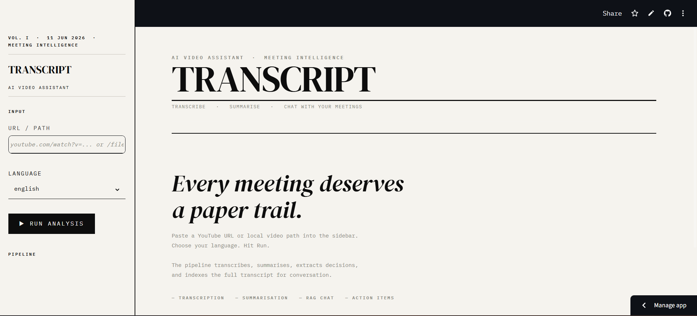
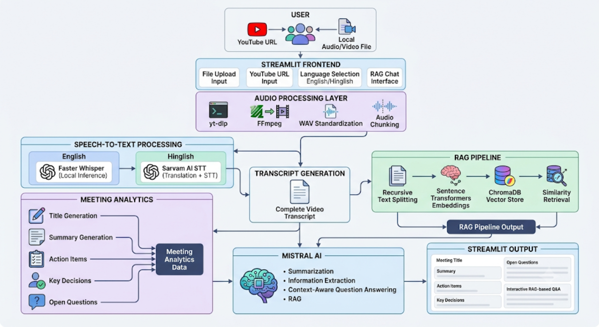

# AI Video Assistant RAG

AI Video Assistant RAG is an end-to-end Generative AI application that transforms video or audio content into actionable insights. The system automatically transcribes recordings, generates concise meeting summaries, extracts key information, and enables users to interact with the transcript through Retrieval-Augmented Generation (RAG).

The application supports both YouTube URLs and local media files, making it suitable for meeting analysis, lecture review, interview processing, and knowledge retrieval from long-form audio content.

**Live Application:** https://ai-video-assistant-rag.streamlit.app/

---

## Application Interface



---

## System Architecture



---

## Features

### Audio Processing
- Supports YouTube video URLs
- Supports local audio and video files
- Automatic audio extraction and WAV conversion
- Audio chunking for efficient processing

### Speech-to-Text Transcription
- Whisper integration for English transcription
- Sarvam AI integration for Hinglish transcription and translation
- Long audio handling through chunk-based processing

### Intelligent Meeting Analysis
- Automatic meeting title generation
- Professional meeting summary generation
- Action item extraction
- Key decision extraction
- Open question identification

### Retrieval-Augmented Generation (RAG)
- Semantic search over meeting transcripts
- Context-aware question answering
- Retrieval powered by ChromaDB
- Grounded responses using transcript context

### Interactive Interface
- Streamlit-based user interface
- Real-time processing feedback
- Interactive transcript Q&A
- Session-based chat history

---

## Technology Stack

### Frontend
- Streamlit

### Speech Processing
- OpenAI Whisper
- Sarvam AI Speech-to-Text

### LLM & Orchestration
- Mistral AI
- LangChain
- LangChain Expression Language (LCEL)

### Vector Database
- ChromaDB

### Embeddings
- Hugging Face Sentence Transformers
- all-MiniLM-L6-v2

### Audio Processing
- yt-dlp
- pydub
- FFmpeg

---

## Project Structure

```text
AI-Video-Assistant-RAG/
│
├── asset/
│   ├── app_ui.png
│   └── system_architecture.png
│
├── core/
│   ├── extractor.py
│   ├── rag_engine.py
│   ├── summarizer.py
│   ├── transcriber.py
│   └── vector_store.py
│
├── utils/
│   └── audio_processor.py
│
├── .gitignore
├── app.py
├── main.py
├── requirements.txt
├── packages.txt
├── requirements.txt
└── test.py
```

---

## Workflow

### 1. Input Acquisition
The user provides either:
- A YouTube URL
- A local audio/video file

### 2. Audio Processing
The system:
- Downloads or loads the media
- Converts it to WAV format
- Splits long audio into manageable chunks

### 3. Transcription
Audio chunks are transcribed using:
- Whisper (English)
- Sarvam AI (Hinglish)

### 4. Transcript Analysis
The generated transcript is used to:
- Generate a meeting title
- Generate a concise summary
- Extract action items
- Extract key decisions
- Extract unresolved questions

### 5. RAG Pipeline
The transcript is:
- Split into chunks
- Converted into embeddings
- Stored in ChromaDB
- Retrieved using semantic similarity search

### 6. Question Answering
Users can ask questions about the meeting and receive context-aware answers grounded in the transcript.

---

## RAG Architecture

```text
Transcript
    │
    ▼
Text Chunking
    │
    ▼
Embeddings (all-MiniLM-L6-v2)
    │
    ▼
ChromaDB
    │
    ▼
Retriever (Top-K Search)
    │
    ▼
Prompt Construction
    │
    ▼
Mistral AI
    │
    ▼
Final Answer
```

---

## Installation

### Clone the Repository

```bash
git clone https://github.com/manishmahara23/AI-Video-Assistant-RAG.git
cd AI-Video-Assistant-RAG
```

### Create Virtual Environment

```bash
python -m venv .venv
```

### Activate Virtual Environment

Windows:

```bash
.venv\Scripts\activate
```

Linux / Mac:

```bash
source .venv/bin/activate
```

### Install Dependencies

```bash
pip install -r requirements.txt
```

---

## Environment Variables

Create a `.env` file in the root directory.

```env
MISTRAL_API_KEY=your_mistral_api_key
SARVAM_API_KEY=your_sarvam_api_key
```

Optional:

```env
WHISPER_MODEL=small
SARVAM_STT_MODEL=saaras:v2.5
```

---

## Running the Application

### Streamlit Interface

```bash
streamlit run app.py
```

### Command Line Version

```bash
python main.py
```

---

## Model Configuration

### LLM
- Model: `mistral-small-latest`
- Temperature: `0.3`

### Embedding Model
- Model: `all-MiniLM-L6-v2`
- Embedding Dimension: `384`

### Vector Database
- ChromaDB
- Persistent Local Storage

---

## Future Improvements

- Hybrid Retrieval (BM25 + Dense Retrieval)
- Reranking using Cross Encoders
- Semantic Chunking
- Structured Outputs using Pydantic
- Parallelized Summarization Pipeline
- Docker Deployment
- Multi-user Support
- Speaker Diarization

---

## Author

**Manish Mahara**

B.Tech CSE (AI/ML & Robotics)  
DIT University

GitHub: https://github.com/manishmahara23

---

## License

This project is intended for educational, research, and portfolio purposes.
